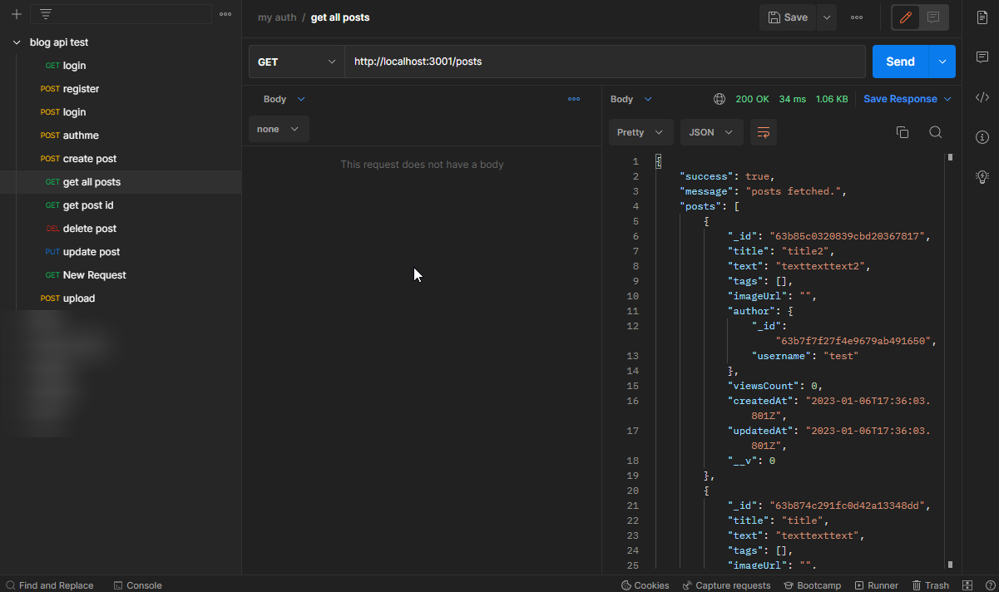

# Articles Blog Api Example

Teches: JS, Express, MongoDB.

<hr>

Libs:

1) multer - file uploading
2) jsonwebtoken - jwt tokens generation
3) bcrypt - password hash generation

<hr>

To test can use postman, collection.json include below in git.

<hr>

Reqs: 
1) Docker with MongoDB:
```
docker run --name -d -p 27017:27017 mongo:6.0.3
```
2) Nodejs v18 (can use nvm)

<hr>

#### Demo

